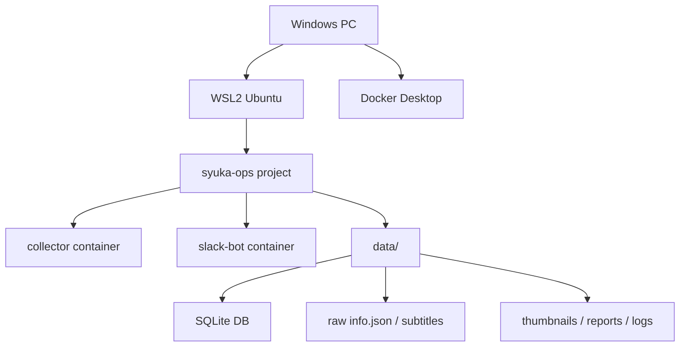

# Windows Server with WSL2 + Docker + syuka-ops

## Goal

`syuka-ops`를 Windows PC 한 대에서 안정적으로 운영하는 구성안입니다.

목표는 다음 2가지입니다.

1. 슈카월드 영상 메타데이터, 썸네일, 자막을 자동 수집
2. Slack 연동과 조회 기능을 서버처럼 상시 운영

이 문서는 "Windows 순정 환경"보다 `WSL2 + Docker` 구성을 우선 추천하는 이유와 실제 운영 방식을 정리합니다.

## Why WSL2

현재 `syuka-ops`는 다음 특성이 있습니다.

- Python 기반 수집기
- `yt-dlp` 중심 동작
- 쉘 스크립트와 경로 처리
- Docker 운영 전제
- 반복 배치/로그 점검 필요

이런 종류의 프로젝트는 Windows 순정 PowerShell만으로도 운영할 수는 있지만, 실제로는 Linux 계열 환경이 더 단순합니다.

`WSL2`를 쓰면 좋은 점:

- 지금 Mac에서 하던 작업 방식과 거의 비슷함
- 쉘 명령, Python 실행, 경로 처리 방식이 안정적임
- Docker와 궁합이 좋음
- `yt-dlp`, `ffmpeg`, 로그 파일 관리가 편함
- 나중에 Codex/CLI 계열 도구를 붙이기에도 유리함

## Recommended Architecture



핵심은 이렇습니다.

- Windows는 호스트
- 실제 작업 폴더는 WSL2 내부 Linux 경로에 둠
- Docker Desktop은 설치하되, WSL2 엔진과 연결
- `syuka-ops`는 WSL2 안에서 실행/관리

## Recommended Folder Layout

WSL2 Ubuntu 안에서 예를 들면 이렇게 둡니다.

```text
~/code/syuka-ops
```

권장 이유:

- `/mnt/c/...` 보다 훨씬 빠르고 안정적임
- Linux 경로라서 권한/파일명 이슈가 적음
- Docker bind mount가 예측 가능함

권장하지 않는 위치:

- `/mnt/c/Users/...`
- OneDrive 동기화 폴더
- Windows 바탕화면/문서 폴더

## What To Copy From Mac

가장 추천하는 이관 방식은 "코드 + 데이터 통째 복사"입니다.

복사 대상:

- 프로젝트 전체 폴더 `syuka-ops/`
- 특히 `data/` 전체

중요한 데이터:

- `data/db/syuka_ops.db`
- `data/scripts/raw/`
- `data/thumbnails/`
- `data/reports/`
- `data/logs/`

이 방식의 장점:

- 다시 전수 수집할 필요가 없음
- 지금까지 모은 subtitle/info/thumbnail 자산을 그대로 활용 가능
- Windows에서는 이후 증분 수집만 하면 됨

## Initial Setup Sequence

### 1. Windows 준비

- Windows 11 또는 최신 Windows Server/Windows 10
- BIOS/UEFI에서 가상화 활성화
- 관리자 권한 PowerShell 준비

### 2. WSL2 설치

PowerShell 관리자 권한:

```powershell
wsl --install
```

설치 후 Ubuntu 배포판을 준비하고 초기 사용자 계정을 만듭니다.

확인:

```powershell
wsl --status
wsl -l -v
```

### 3. Docker Desktop 설치

- Docker Desktop 설치
- 설정에서 `Use the WSL 2 based engine` 활성화
- Ubuntu 배포판에 대해 WSL integration 활성화

확인:

```bash
docker --version
docker compose version
```

### 4. 프로젝트 복사

Mac에서 `syuka-ops/` 폴더를 압축하거나 rsync/scp 등으로 옮긴 뒤, WSL2 Ubuntu 내부에 배치합니다.

예:

```bash
mkdir -p ~/code
cd ~/code
# 여기로 syuka-ops 폴더 복사
```

### 5. 기본 동작 확인

```bash
cd ~/code/syuka-ops
docker compose build
docker compose run --rm collector --help
```

## Day-2 Operations

초기 이관이 끝난 뒤에는 전수 수집이 아니라 증분 운영만 하면 됩니다.

권장 루틴:

1. 하루 1~2회 `incremental`
2. 실패 건이 있으면 `retry-failed`
3. 리포트는 하루 1회 또는 3~5배치마다 생성

예시:

```bash
cd ~/code/syuka-ops
docker compose run --rm collector --mode incremental --base-dir /data
```

필요 시 쿠키 사용:

```bash
cd ~/code/syuka-ops
docker compose run --rm collector \
  --mode incremental \
  --base-dir /data \
  --cookies /data/youtube-cookies.txt
```

## Scheduling

Windows에서 자동화는 보통 두 가지 선택지가 있습니다.

### Option A. Windows Task Scheduler

추천 기본안입니다.

- 작업 스케줄러가 `wsl.exe` 또는 `docker compose` 실행
- 하루 1~2회 증분 수집
- 필요 시 별도 재시도 작업

장점:

- 운영이 단순함
- Windows 재부팅 후 자동 재개가 쉬움
- UI로 상태를 확인하기 쉬움

### Option B. Linux cron/systemd inside WSL

가능은 하지만 초기에 꼭 필요하진 않습니다.

단점:

- WSL 인스턴스가 항상 살아 있다는 전제가 필요
- Windows 호스트 재부팅 후 복구 흐름이 더 복잡할 수 있음

결론:

- 자동화는 Windows Task Scheduler
- 실제 실행 환경은 WSL2 내부 프로젝트 + Docker

이 조합이 가장 운영하기 쉽습니다.

## Suggested Automation Design

권장 스케줄:

- 오전 9시 1회 `incremental`
- 오후 2시 1회 `incremental`
- 오후 2시 20분 `retry-failed`
- 하루 1회 리포트 생성

이유:

- 채널 특성상 하루 1~2회면 충분함
- 너무 자주 돌리면 호출 제한 가능성이 올라감

현재 저장소에는 작업 스케줄러 등록 보조 스크립트도 포함되어 있습니다.

등록:

```powershell
cd C:\Users\User1\Documents\code\syuka-ops
powershell -ExecutionPolicy Bypass -File .\ops\windows\register_collector_tasks.ps1
```

삭제:

```powershell
cd C:\Users\User1\Documents\code\syuka-ops
powershell -ExecutionPolicy Bypass -File .\ops\windows\unregister_collector_tasks.ps1
```

등록되는 작업:

- `syuka-ops collector incremental 0900`
- `syuka-ops collector incremental 1400`
- `syuka-ops collector retry-failed 1420`

배치 파일이 이미 프로젝트 루트로 이동한 뒤 `docker compose run --rm collector ...`를 실행하므로, 작업 스케줄러에서는 별도 작업 폴더를 잡지 않아도 됩니다.

## Cookie Strategy

남은 예외 케이스와 `HTTP 429` 대응을 보면, Windows 서버에서는 쿠키를 준비해두는 편이 좋습니다.

권장 방식:

- Windows Chrome 로그인 세션에서 `cookies.txt` export
- 그 파일을 `data/` 아래 두고 collector에 전달

예:

```text
~/code/syuka-ops/data/youtube-cookies.txt
```

장점:

- 브라우저 종속성이 줄어듦
- 서버/자동화에 넣기 쉬움
- `--cookies-from-browser`보다 예측 가능함

## Logging and Health Checks

운영 중 자주 볼 항목:

- `data/logs/`
- 최신 `.xlsx` 리포트
- `download_attempts` 테이블

간단 점검 포인트:

- 신규 영상 수가 늘었는지
- `transcripts`가 늘었는지
- `failed/skipped`가 급증했는지
- 리포트 생성 시각이 최신인지

## Docker Update Rule

운영 중 수정 사항을 반영할 때는 아래처럼 구분하면 됩니다.

- `.env` 같은 환경변수만 바뀐 경우:
  `docker compose up -d --force-recreate`
- Python 소스, 의존성, Dockerfile이 바뀐 경우:
  `docker compose build` 후 `docker compose up -d --force-recreate`

현재 `slack-bot`, `collector` 모두 소스 코드를 이미지 안에 복사해서 실행하는 구조이므로,
코드 수정은 단순 재시작만으로는 반영되지 않습니다.

## Shorts Note

현재 기본 채널 URL은 `https://www.youtube.com/@syukaworld/videos`입니다.
즉 기본 수집은 채널의 `videos` 탭 기준으로 동작합니다.

현 시점의 raw 메타를 빠르게 확인해보면:

- `webpage_url`이 `youtube.com/shorts/...` 형태인 항목은 발견되지 않았음
- 100초 미만 후보도 눈에 띄지 않았음

따라서 지금은 쇼츠가 대량으로 섞여 들어가는 징후는 없습니다.
다만 DB에는 `is_short` 같은 명시적 필드가 아직 없으므로, 나중에 채널 운영 방식이 바뀌면 별도 식별/제외 규칙을 추가하는 것이 좋습니다.

## Pros

- Mac에서 하던 구조와 가장 비슷함
- 데이터/코드 이관 후 바로 증분 운영 가능
- Docker 운영이 단순함
- Windows 호스트에서 스케줄링하기 쉬움
- 나중에 Slack bot 상시 운영도 자연스럽게 확장 가능

## Cons

- 초기 설치 단계가 약간 있음
- WSL2, Docker Desktop, Task Scheduler 세 가지를 이해해야 함
- `cookies.txt` 운영 정책은 따로 정해두는 게 좋음

## Recommendation

현재 상황에서는 아래 순서가 가장 좋습니다.

1. Mac의 `syuka-ops` 전체를 WSL2 Ubuntu 내부로 복사
2. Docker build / collector help 확인
3. DB와 리포트가 그대로 보이는지 확인
4. `incremental` 1회 실행
5. Windows Task Scheduler 등록
6. 그 다음 Slack bot 운영 추가

## Decision Summary

운영 목표가 "윈도우 PC 한 대를 슈카월드 수집 서버처럼 쓰기"라면, 현재로서는 다음 구성이 가장 추천됩니다.

- Windows 호스트
- WSL2 Ubuntu
- Docker Desktop with WSL2 engine
- `~/code/syuka-ops`에 프로젝트 배치
- Task Scheduler로 하루 1~2회 `incremental`

즉, Windows를 그대로 쓰되 실제 작업 환경은 Linux처럼 운영하는 방식입니다.
